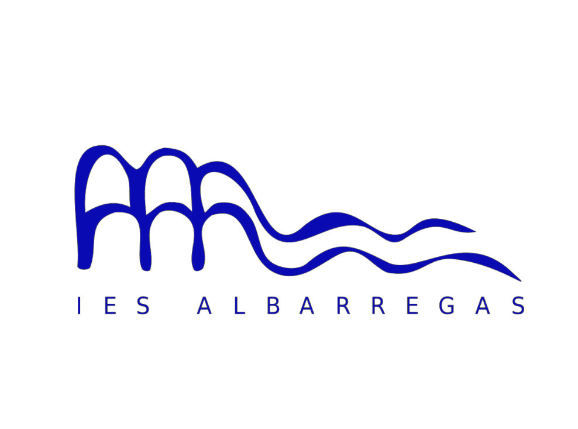

# Tarea1.1.1

### Encabezados
# Encabezado 1
## Encabezado 2
### Encabezado 3
#### Encabezado 4
##### Encabezado 5
###### Encabezado 6

### Negrita y cursiva
Escribiremos cosas importantes en **negrita** o *cursiva*

### Bloques de código

```Podremos escribir bloques de código de esta manera
nombre = "Javier"
print(nombre)
```

### Listas
- Servicios en red
- Sostenibilidad
1. Alberto
2. Eloy

### Listas anidadas
- Módulos
  - Servicios en red
  - Sostenibilidad
1. Profesores
   1. Alberto
   2. Eloy
### Enlaces
[Moodle](https://informatica.iesalbarregas.com/?redirect=0)

### Imágenes y rutas


#### Imagen que funciona como enlace
[]

### Tablas

| Modulo | Profesores |
| --- | --- |
| Servicios en red | Alberto |
| Sostenibilidad | Eloy |


### Párrafos y saltos de línea
Esto sería el primer párrafo.

Esto sería el segundo párrafo.

Una línea.  
La siguiente línea.

### Citas y comentarios
> Esto sería una cita.
<!-- Esto sería un comentario -->
